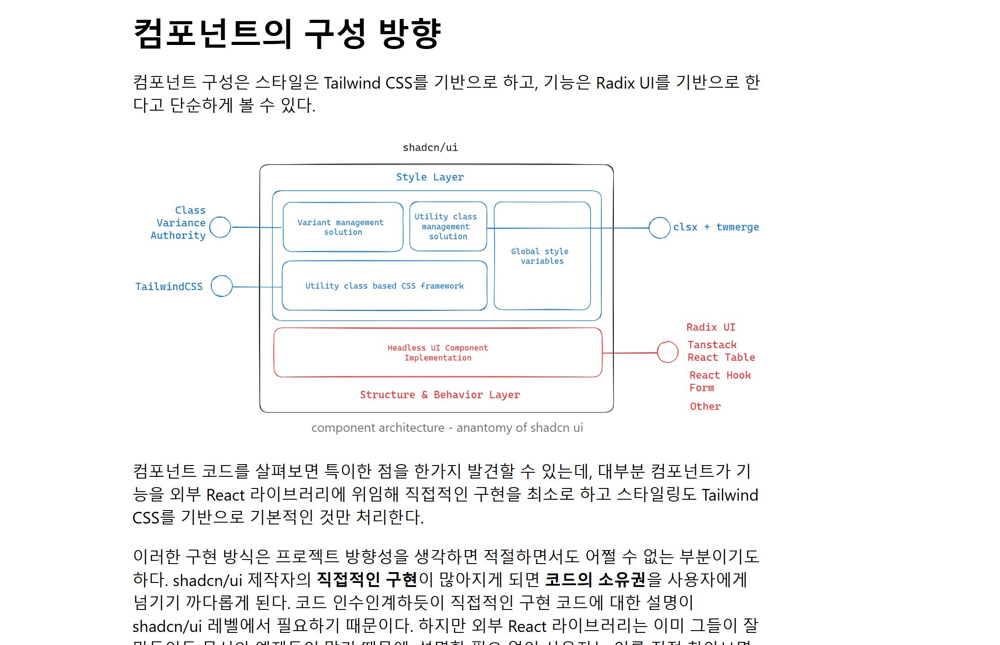

```
class Person1 {
    name: string
    age?: number
}

let jack1 : Person1 = new Person1()
jack1.name = 'Jack', jack1.age = 32
```

- Person1이라는 클래스를 만들면 그 클래스를 이용해서 비슷한 특징을 가진 객체(인스턴스)를 여러 개 만들 수 있음

- new Person1()의 의미

    new: 클래스를 기반으로 새로운 객체(인스턴스)를 생성할 때 사용하는 키워드

    () : 생성자 함수를 실행(따로 설정되어 있지 않으므로 
```
class Person1 {
    name: string;
    age?: number;

    // 기본 생성자 (TypeScript가 자동으로 추가)
    constructor() { }
}

// 내부적으로는 이렇게 동작하는 것과 같음!
)
```
Person1 클래스를 기반으로 새로운 빈 객체를 만든다.
-> (기본 생성자가 실행되지만 아무 일도 하지 않음).
-> 새로운 객체를 jack1 변수에 할당한다.

1. Person1 클래스를 이용해서 새로운 객체를 만든다 
2. 이 객체는 Person1 클래스의 구조(name, age)를 따라야함
3.jack1은 Person1 타입의 객체(인스턴스)가 됨


SSE

shadcn-ui
)


[clonecoding]

react 19
next 15
tailwind v4

npx create-next-app@latest discord-clone --typescript --tailwind --eslint

npx tailwindcss-cli@latest init

npx shadcn@latest init
